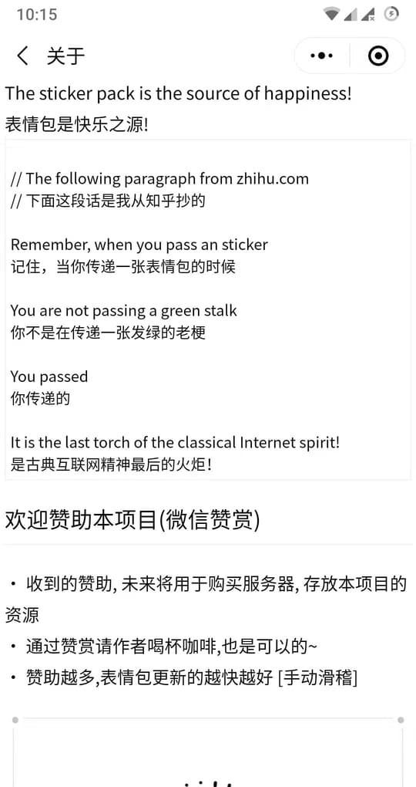
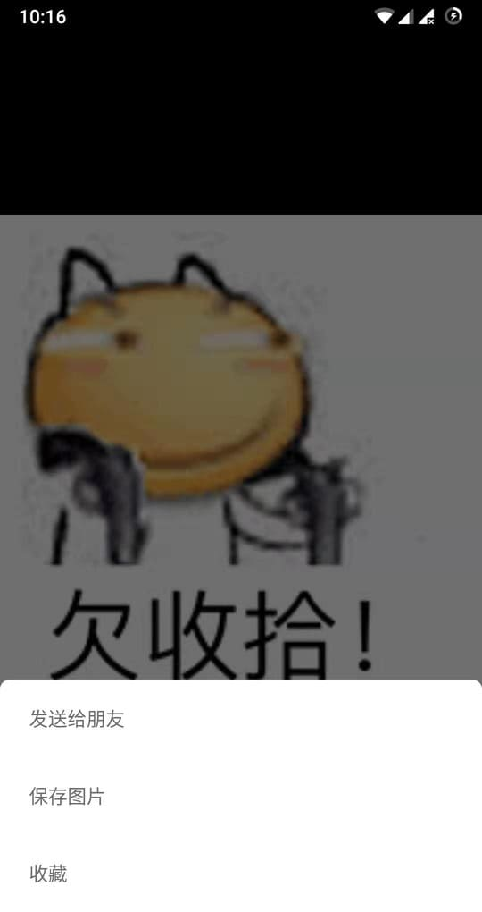

# ChineseBQB-client

> 中国表情包大集合客户端

## 说明

* 本项目使用 [Taro](https://github.com/NervJS/taro) 框架开发

* 图片资源来自 [ChineseBQB](https://github.com/zhaoolee/ChineseBQB) 项目

* 由于小程序无法直接访问 GitHub，所以通过 Nginx 做了一层代理

```
server {
  listen      443 ssl;
  server_name proxy.youngon.com.cn;
  
  location / {
    root   /usr/share/nginx/html;
    index  index.html index.htm;
  }

  location /github/api/ {
    proxy_pass https://api.github.com/;
  }

  location /github/raw/ {
    proxy_pass https://raw.githubusercontent.com/;
  }

  ssl_certificate /etc/nginx/keys/proxy.youngon.com.cn.crt;
  ssl_certificate_key /etc/nginx/keys/proxy.youngon.com.cn.key;
}
```

## 截图

<p style="vertical-align: center">
  
  
  
  
  
  
</p>
